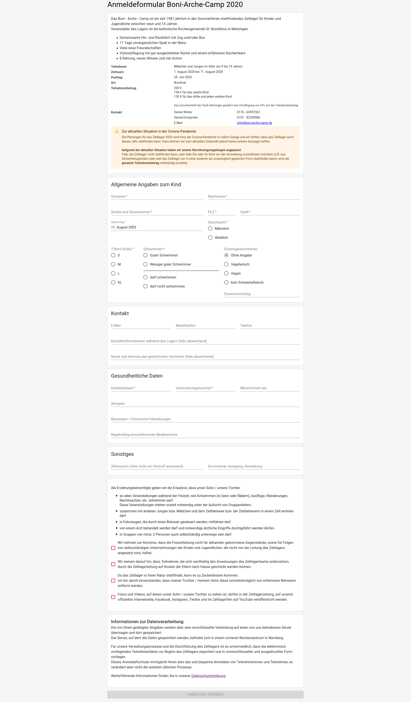

# Digital children's camp registration form

This is a digital (german) registration form for a kids camp.  
  
The simple mobile-friendly UI is powered by [React](https://reactjs.org/) and [Material UI](https://material-ui.com/).  
The backend is powered by [Strapi](https://strapi.io/).  
  
The backend does only allow creating registration entities and the UI does nothing more than sending the form data to the backend.  
  
Feel free to fork or clone this and adapt it to your needs.  
Most of the text content can easily be changed in the `config.json`, some other text can be easily changed in the component itself.

## Screenshot

## License
MIT

## Author
Frédéric Bolvin for the [Boni-Arche-Camp](https://boni-arche-camp/) Team.
